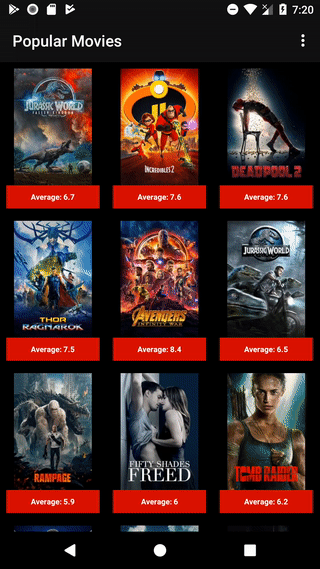

# udacity Popular Movies App

## Config project
Go to ```./gradle.properties``` file and set in ```themoviedb``` variable a valid api key from [themoviedb](https://www.themoviedb.org/login)

## Preview
